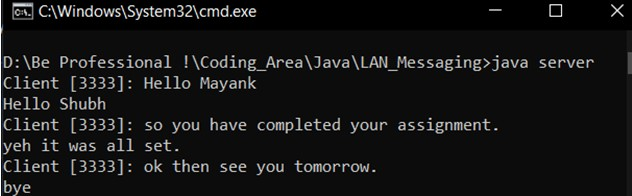
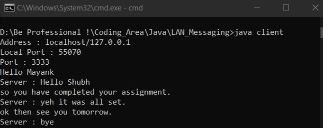

# client-server
This program is made to demonstrate the utilization of java.net package. 
It provides LAN communication facilities between client and server. 
<ul>
  <li><b>Language</b> : Java </li>
  <li><b>Package</b>  : java.net,java.io </li>
  <li><b>Future improvements</b> : building another GUI version of this program. </li>
</ul>
## Server

## Client

